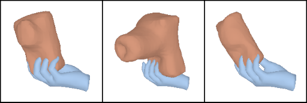
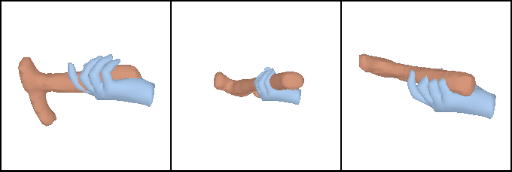
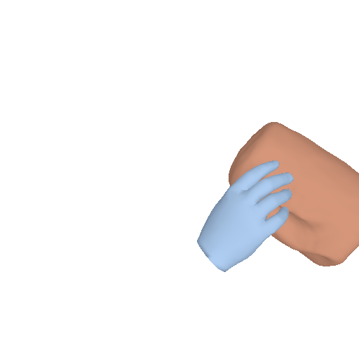
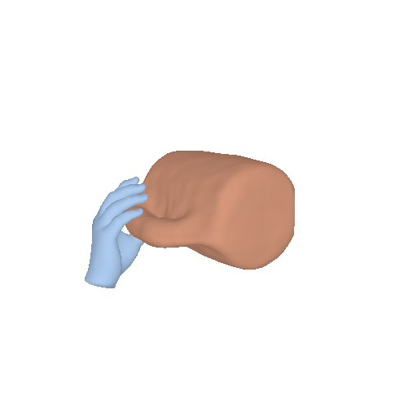

# G-HOP: Generative Hand-Object Prior for Interaction Reconstruction and Grasp Synthesis
Yufei Ye, Abhinav Gupta, Kris Kitani, Shubham Tulsiani, in CVPR2024

[[Project Website]](https://judyye.github.io/ghop-www) [[Arxiv]](https://arxiv.org/abs/2404.12383)

## Installation 
0. Start with a clean environment
    ```
    conda create -n ghop python=3.10 -y
    conda activate ghop
    ```
1.  **Easy setup** (environment, pre-trained models, data, etc. ) Installing pytorch3d may take a while.
    ```
    bash scripts/one_click.sh
    ```
2. **Download MANO model.**
Due to license constraints, please download MANO model from [their official website](https://mano.is.tue.mpg.de/). Place it under `third_party/`. 

The path variables can also be re-defined at [`ddpm3d/configs/environment/default.yaml`](ddpm3d/configs/environment/default.yaml) (prior) and [`configs/environment/default.yaml`](configs/environment/default.yaml) (reconstruction part). 

<details>
  <summary>Here is the folder structure that our code assumes.</summary>
  
  ```
  output/
    # pretrained diffusion model
    joint_3dprior/
      mix_data/
        checkpoints/
        config.yaml
      hoi4d/
        checkpoints/
        config.yaml
    
    # Our test-time optimization results
    hoi4d/
      Mug_1/
        ckpts/
        config.yaml
      Mug_2/
      ...

  # preprocessed data
  data/
    # preprocessed data for video reconstruction
    HOI4D_clip/
      Mug_1/
        image/
        mocap/
        ....
      Mug_2/
      ...
    # preprocessed data for grasp synthesis
    HO3D_Grasp/  
      003_cracker_box/
        obj.txt 
        oObj.obj 
        uSdf.npz
      ...


  # MANO
  third_party/mano_v1_2/models/
    MANO_RIGHT.pkl
    MANO_UV_right.obj
    ...
  ```
  </details>

## Inference
### Sample Hand-Object Interactions
```
python -m generate S=3 \
    cat_list=bowl+camera+hammer+binoculars+flashlight  \
    load_index=joint_3dprior/mix_data \
```


The output are 3 HOI generations per categories, saved at `${environment.output}/\${load_index}/vis`.

The output should be similar to the following:
| camera |  | 
| --- | --- |
| hammer |  | 


### HOI Reconstruction from Videos
- **Visualize our reconstructions**

    Suppose the models are under `${environment.output}/hoi4d/`. The following command will render all models that matches `${load_folder}*` and save the rendering to `${load_folder}/SOME_MODEL/vis_clips`.
    ```
    python -m tools.vis_clips  -m \
        load_folder=hoi4d/     video=True  
    ```
    Note there is a `/` at the end of the `load_folder` since the search pattern is `${load_folder}*`.

The output should be like the following: 
| Input | Novel View | HOI |
| --- | --- | --- |
|  |  | 

    
- **Run your own HOI4D reconstruction** (~1 hour):
    
    Suppose the sequences are under `${environment.data_dir}/HOI4D_clip/`
    + Optimize one sequence:
    ```
    python -m train  -m   \
        expname=recon/\${data.index} \
        data.index=Kettle_1 \
    ```
    + Optimize all HOI4D sequences: 
    ```
    python -m train  -m   \
        expname=recon/\${data.index} \
        data.cat=Mug,Bottle,Kettle,Bowl,Knife,ToyCar data.ind=1,2 \
    ```
- **Run on custom data**. 
    Please refer to [the preprocess process](https://github.com/JudyYe/diffhoi_barely_clean?tab=readme-ov-file#run-on-custom-data) in our prior work.


### Human Grasp Syntheis
- Grasp objects in demos. 
    ```
    python  -m grasp_syn -m grasp_dir=\${environment.data_dir}/HO3D_grasp
    ```
- Preprocess your own data. Given an object mesh, we need to preprocess the mesh to specify its class name and to compute its SDF grid. An example code to preprocess YCB objects can be found [here](prprocess/make_grasp.py). 

<!-- 
## Train / Finetune on your own dataset


To train your own model,  implement your own dataloader and run: 
```
python -m  ddpm3d.base -m \
  expname=your_own_model \
  # optional
  ckpt=PATH_TO_PRETRAINED_MODEL \
``` -->


## FAQ
- [Notes on coordinate system.](docs/coord.md)


## License and Acknowledgement
The majority of GHOP is licensed under CC-BY-NC, however portions of the project are available under separate license terms: SDFusion is licensed under the MIT license.


This project is built upon this amazing repo.
We would also thank other great open-source projects:
- [FrankMocap](https://github.com/facebookresearch/frankmocap/) (for hand pose esitmation)
- [STCN](https://github.com/hkchengrex/STCN) (for video object segmentation)
- [SMPL/SMPLX](https://smpl-x.is.tue.mpg.de/), [MANO](https://github.com/hassony2/manopth)
- [Pytorch3D](https://github.com/facebookresearch/pytorch3d) (for rendering)
- [pytorch-lightning](https://lightning.ai/) (for framework)
- [SDFusion](https://yccyenchicheng.github.io/SDFusion/) (for diffusion model architecture to generate SDFs)

