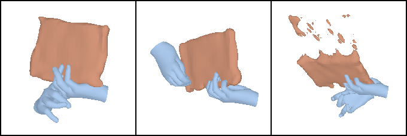
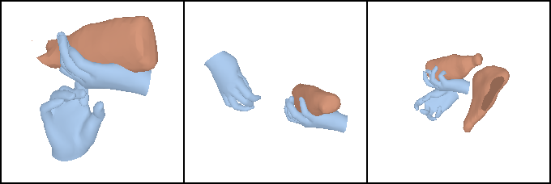
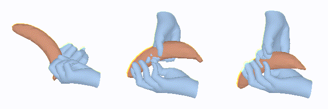
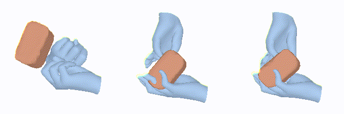

# BG-HOP: A Bimanual Generative Hand-Object Prior

## Installation 

- Follow the installation steps in [ghop.md](ghop.md).
- Download pretrained checkpoints from [huggingface.co/REMOVED FOR ANONYMITY/bghop](https://huggingface.co/REMOVED FOR ANONYMITY/bghop) and place them in `output/`.

### Sample HOI Generations

| notebook |  | 
| --- | --- |
| ketchup |  | 

### Sample Grasp Synthesis

| Object | SDS Iter 0 ------------ SDS Iter 500 ------------ SDS Iter 1000 |
| --- | --- |
| banana |  | 
| potted meat can |  | 


## Notes for training BG-HOP

- Changes:
  - Change wandb username in `ddpm3d/configs/environment/default.yaml` and `configs/environment/default.yaml`
  - Run dummy training with:
  `python -m ddpm3d.base`

- For some reason, there was some issue with the checkpoint having extra MANO params. Getting around it:
```
import torch
ckpt = torch.load("output/joint_3dprior/mix_data/checkpoints/last.ckpt")

for key in ckpt["state_dict"].keys():
   if 'verts_uv' in key:
      ckpt["state_dict"][key] = ckpt["state_dict"][key][:, :891, :]
   elif 'faces_uv' in key or 'hand_faces' in key:
      ckpt["state_dict"][key] = ckpt["state_dict"][key][:, :1538, :]

del ckpt["state_dict"]["glide_model.text_cond_model.model.text_model.embeddings.position_ids"]

torch.save(ckpt, "output/joint_3dprior/mix_data/checkpoints/last_modified.ckpt")
```
- ARCTIC dataset has MANO params with `flat_hand_mean=False`, since G-HOP was trained with datasets having `flat_hand_mean=True`, these values are in the checkpoint and will overwrite our changes. To fix, modify the checkpoint:
```
import torch
ckpt = torch.load("output/joint_3dprior/mix_data/checkpoints/last_modified.ckpt")

keys = [i for i in ckpt["state_dict"] if "th_hands_mean" in i]
for key in keys:
    ckpt["state_dict"][key] = ckpt["state_dict"]["ae.model.hand_cond.hand_wrapper.hand_mean"]
torch.save(ckpt, "output/joint_3dprior/mix_data/checkpoints/last_modified.ckpt")
```

### Pre-processing ARCTIC

- Generate articulated versions of the various object meshes so that we can precompute SDFs:
```python preprocess/arctic_articulated_meshes.py --root </path/to/arctic/data>```

- Generate SDFs for articulated meshes (remember to change paths):
```
python -m preprocess.make_sdf_grid --ds arctic
```
(I needed to set `PYOPENGL_PLATFORM=egl` to get it working)

- Generate train/val splits by copying `preprocess/arctic_contact.patch` and `preprocess/process_seqs_contact.py` to the the ARCTIC repo (`arctic/scripts_data`) and then running:
```
git apply scripts_data/arctic_contact.patch
python scripts_data/process_seqs_contact.py --export_verts
```

### Train

Bimanual:
```
python -m ddpm3d.base environment.data_dir=/path/to/arctic/data enable_bimanual=True
```

Single hand:
```
python -m ddpm3d.base environment.data_dir=/path/to/arctic/data enable_bimanual=False
```

With quick visualizations:
```
python -m ddpm3d.base environment.data_dir=/path/to/arctic/data log_frequency=10 print_frequency=10
```

### Grasp Synthesis

```
python -m grasp_syn -m grasp_dir=\${environment.data_dir}/HO3D_grasp
```

### Generation

```
python -m generate S=3 cat_list=box
```

### Reconstruction (in progress.....)

```
python -m train  -m   \
    expname=recon/\${data.index} \
    data.index=s05.box_grab_01 \
    data=arctic
```

Reconstruction needs additional data to be placed in `data/arctic_clip/<seq-name>`:
- `text.txt` - Name of object
- `image/` - Directory containing images of resolution 512x512
- `hand_mask` - Binary mask of hand
- `obj_mask` - Binary mask of object
- `cameras_hoi_smooth_100.npz` - .npz file containing keys `K_pix` (intrinsics as a 4x4 for some reason) and `cTw` (world to camera).
- `hands_smooth_100.npz` - .npz file containing keys `hA` (mano theta) and `beta` (mano beta) 


### Expected directory structure for ARCTIC

```
arctic/data/
|-- arctic_data/              # Original dataset from ARCTIC
|-- arctic_mesh/              # Generated from preprocess/arctic_articulated_meshes.py
|-- arctic_sdf/               # Generated from preprocess/make_sdf_grid
|-- body_models/              # Original body models from ARCTIC dataset
|-- arctic_contact_all.csv    # Generated from ARCTIC repo after applying preprocess/arctic_contact.patch
|-- arctic_contact_train.csv  # Generated from ARCTIC repo after applying preprocess/arctic_contact.patch
|-- arctic_contact_val.csv    # Generated from ARCTIC repo after applying preprocess/arctic_contact.patch
```

- We need to download only the following from ARCTIC:

```
export SMPLX_USERNAME=""
export SMPLX_PASSWORD=""
export MANO_USERNAME=""
export MANO_PASSWORD=""
./bash/download_body_models.sh # SMPLX and MANO
export ARCTIC_USERNAME=""
export ARCTIC_PASSWORD=""
./bash/download_misc.sh # raw_seqs/ (MANO and object poses in world coords) and meta/ (object meshes)

python scripts_data/unzip_download.py # unzip downloaded data
```

## License and Acknowledgement
BG-HOP builds extensively on G-HOP, we thank the authors for releasing their code!
